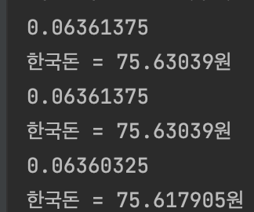
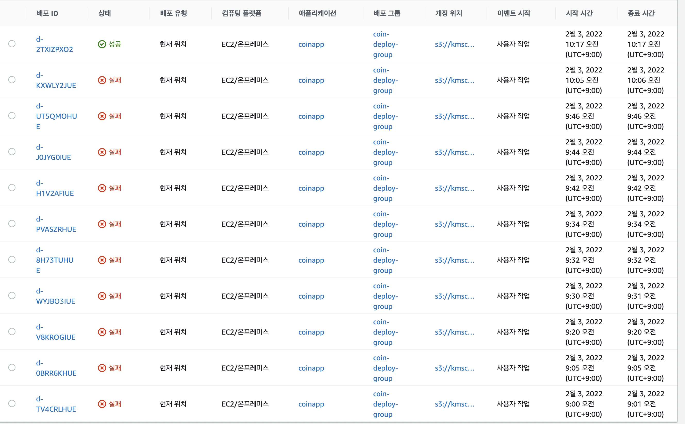

# binance_NFT

진행상황(01.18) : Binance에 상장되어있지 않아서 FTX거래소 API를 사용.

<https://docs.ftx.com/?python#rest-api>

Python 예제 코드를 참조하여 코드를 작성. 

시크릿키가 포함되어 있기에 소스코드는 안 올림.

GET요청 성공.

FTX API에 공부해야함..

----- 

## 삽질의 기록

FTX 거래소에서 Python을 지원해서 일단 데이터를 긁어오는데에는 성공했다.

하지만, 나는 자바를 주로 이용해서 고민이 생겼다.

Python 데이터를 Java단으로 옮기고 싶었다.

물론 Django를 이용해서 하나의 서버에서 처리할 수도 있지만, 따로 배우고 싶지않았다.

여기서 발목이 잡히고 싶지 않아서 Python 데이터를 java단으로 옮겨주기로 했다.

생각한 것은 3개다.

1. rgpc 
2. RestAPI
3. 셸스크립트

### 셸스크립트

먼저 셸 스크립트 방식을 사용했다.  
<https://velog.io/@latte_h/Java%EC%97%90%EC%84%9C-Python-%EC%82%AC%EC%9A%A9%ED%95%98%EA%B8%B0>

이 블로그를 참조하였는데, 결국에는 실패했다.


내 생각에는 저 방식은 정말 위에서부터 코드를 한줄한줄 처리하는것 같은데 비효율적이라고 생각이 들었고, 무엇보다도 그렇게 실행되면 안되었다.

### rgpc

좀 찾아봤는데, 문법도 그렇고 공부하기 어려워서 일단 RestAPI를 써보기로 했다. 구현해야할 부분이 많기때문에..

### RestAPI

python의 Requests객체를 생성하여 처리한다.

통신을 잘한다.


해당 데이터를 가지고 내가 알고있는 코인과 환율을 연동해서 한국돈으로 바꿔서 출력하는데까지 성공했다.



떡락의 길을 걷고있네.


### Node js + Vue.js 설치

클라이언트쪽에서 위에서 긁어온 데이터를 받아주고 요청할 서버가 없다는 것을 알았다.

처음에는 ajax를 사용할까 했지만, 뷰도 한꺼번에 그려주고 싶기도 하고 vue.js를 배워보고 싶어서 골랐다.

react와 vue중에 뭐를 사용할까 고민을 많이했는데, vue.js문법이 상대적으로 쉽다는 말에 vue.js를 골랐다. 중요한건 로직이지 화면에 그리는게 문제가 아니기 때문이었다.

아무튼 설치하는 과정은

<https://imasoftwareengineer.tistory.com/39>

이 블로그를 참고했다.

과정에 삽질이 많았지만 아무튼 띄우기까지 완료

vue에 대한 기초적인 지식을 학습하기 위해 인프런에서 강의를 들은 후 모르는건 찾아서 해야겠다.


주말동안 vue에 대한 공부를 하고 데이터를 옮기는데에 성공했다.


GET요청으로 Spring서버에 요청을 보내 코인에 대한 정보를 받아오고 이를 동적으로 뿌려준다.

즉, 저 화면이 요청을 보낼때마다 바뀐다. 요청은 하루 api호출 제한으로 30초마다로 잡았다.


- 이제 서비스 기능을 더 추가할 것이다.
- 디비는 인메모리로 그냥 HashMap에 저장해서 사용하고 있는데, Redis를 사용해보고 싶다.
- 화면 꾸미는건 나중에

서비스 부분을 추가하는것에 집중해야겠다.

redis DB와 연동해야겠다.

-----

### Redis 연동 기록

Redis와 연동하는건 어렵지 않았다.

그 전에 JPA를 학습한 적이 있어서 메소드들을 다루기 쉬웠다.

물론 확장함에 있어서 Redis부분을 더 손봐봐야겠지만.. 그래도 해결하였다.

30초마다 데이터를 DB에서 뽑아 뿌려주는걸 완료했다.


-----

### AWS로 옮기기

AWS EC2에 서버를 두기로 했다. 이유는 맥으로 작업하다보니 와이파이에 따라 동적으로 ip가 바뀌어서 매 번 설정해주기 귀찮아서.

물론 수작업으로 고정 ip로 바꿀 방법이 분명 있겠지만, 공부할겸 하기로 했다.


여기서도 삽질을 했다.

AWS EC2연동은 오랜만이라 설정 부분에서 일이 있었다.

2가지 삽질이 있었다.

첫 번째는 블로그의 오타를 그대로 따라했다.

설정 부분에서

```text
Host kms
    HostName 어쩌구 저쩌구
    User 어쩌구 저쩌구
    IdentityFile 어쩌구 저쩌구
```

이렇게 써야하는데, IdentityFile 처음에 **IdentifyFile**로 썼다. 내가 본 블로그에서 그대로 복사했더니 오류가 발생.. 그래서 이러한 삽질이 있었다.

두 번째 삽질은 User를 아무렇게나 설정해도 된다는 말에 아무렇게 설정해서 에러가 났다.
AWS EC2에서 지정한 User를 써야 식별이 가능하다. 나같은 경우 us-ec2인가 이렇게 되어 있어서 이렇게 수정해주었다.


그 다음은 bucket을 만들고 IAM을 등록.


EC2환경에서 자바설치.


### Jenkins 사용

실패. AWS의 EC2, t2.micro는 메모리가 1GB라서 Jenkins 빌드 중에 터지는 에러가 발생.

swap memory를 통해 해결할 수 있다지만, 그냥 gitactions을 사용하기로 정함. 이것도 터지면 swap을 사용해야할 듯

### Jenkins 폐기 git actions 사용

git action을 사용하는데, 일단 working-directory설정에 삽질을 함. 경로에 오타가 있어서..

local에 배포하는건 성공. 이제 이것을 AWS 서버에 옮기는 작업을 해야한다.

성공.

  

이제 EC2에 배포를 해야한다.

ㅠㅠ 삽질을 ㅈ빠지게 했다.



수많은 배포실패의 흔적..

내가 겪은 에러는 다음과 같은데..

>The deployment failed because no instances were found for your deployment group. Check your deployment group settings to make sure the tags for your Amazon EC2 instances or Auto Scaling groups correctly identify the instances you want to deploy to, and then try again.


글이 길어지므로 이 해결과정은 내 개인블로그에 적었다.

<https://kkminseok.github.io/posts/awsdeploy/>

참고 문헌

<https://stalker5217.netlify.app/devops/github-action-aws-ci-cd-3/>

